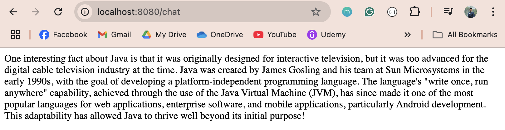

Goal: With Spring AI and OpenAI, build a simple chatbot api and explore other Spring AI provided supports.

### Pre Requisite  
After cloning the project, make sure you have 
1. JDK 24 
2. Maven latest version
3. VScode or IntelliJ installed 
4. OpenAPI api-key that has token enabled [paid version]

### Start the application
    run this command: mvn spring-boot:run

### Stop the aplication
    runn CTRL+C

### promt to the chat bot 
        @GetMapping("/chat")
            public String chat(){

                return chatClient.prompt()
                .user("Tell me an interesting fact about java")
                .call()
                .content();

            }   

### Reply from the ChatBot client    
          